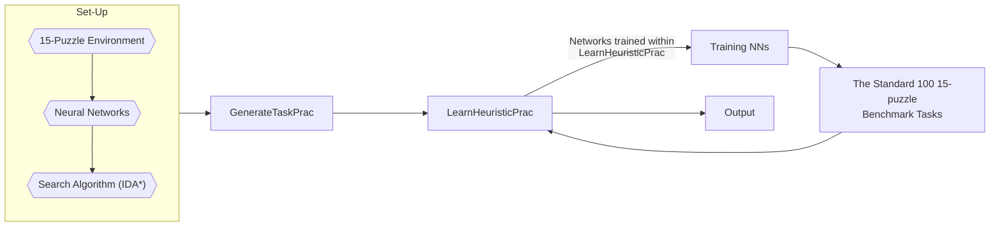

 # Reproducibility_Assignment
This is the term assignment for the Artificial Intelligence (COMS7044A) module. We were tasked to reproduce the results of the paper: "Utilising Uncertainty for Efficient Learning of Likely-Admissible Heuristics".

# 15-Puzzle Solver using NN-WUNN Heuristic

This repository contains code for solving the 15-Puzzle problem using the Neural Network Weighted Upperbound Nearest Neighbor (NN-WUNN) heuristic combined with the Iterative Deepening A* (IDA*) search algorithm.

## How this works
A flow chart depicting the process.

Description: Firstly, we need to set-up the 15-Puzzle environment, then create the two neural networks and set-up the IDA* search algorithm. We need to integrate code from the set-up into creating the GenerateTaskPrac algorithm. The tasks that are generated from the algorithm are taken to LearnHeursticPrac (Created using elements from the set-up as well) to be solved. The training of the neural networks happen within LearnHeuristicPrac. After training, the [standard 100 15-puzzle benchmark tasks](https://cse.sc.edu/~mgv/csce580f11/gradPres/korf_IDAStar_1985.pdf) are fed into LearnHeuristic and we obtain the output.
## Prerequisites

Before running the solver, ensure you have the following prerequisites installed:
- Python 3
- pip (Python package manager)
- NumPy
- TensorFlow
- scikit-learn
- scipy

## Overview

The 15-Puzzle problem is a classic sliding puzzle game where 15 tiles numbered from 1 to 15 are placed in a 4x4 grid with one empty space. The goal is to rearrange the tiles by sliding them into the empty space to achieve a specified goal configuration.

In this project, we employ the NN-WUNN heuristic, a neural network-based approach, to estimate the distance between a given state and the goal state. This heuristic guides the IDA* search algorithm to efficiently explore the state space and find optimal or near-optimal solutions.

## Setup and Usage

1. Clone the repository:

   ```bash
   git clone https://github.com/OShagHennessy/Reproducibility_Assignment.git
   
## Contribution by
Lebohang Mosia
